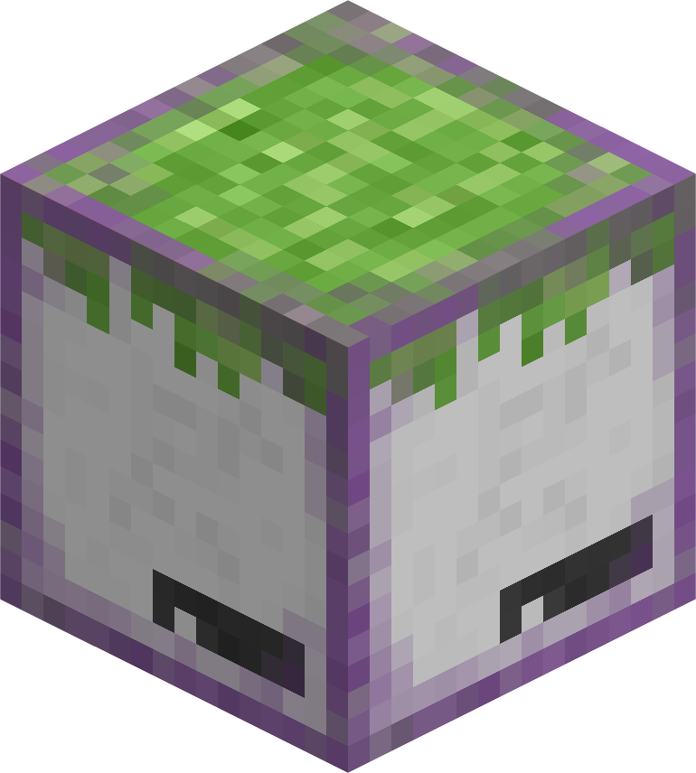



### SharpCraft
clone of ancient minecraft versions, but on raylib (5.0) and c# (.net 8)

---

## how to get the game

### releases (stable)

[click here to open releases](https://github.com/danilwhale/sharpcraft/releases), find release with `Latest` mark, it's
always at the top. then download artifact for your os:
- windows (x64): `SharpCraft-win-x64.zip`
- linux (x64): `SharpCraft-linux-x64.zip`
> [!NOTE]
> there are only 64 bit builds of the game

---

### github actions (canary)

[click here to go to GitHub actions](https://github.com/danilwhale/SharpCraft/actions/),
then select top most link with checkmark from the left, click on it,
scroll down, download artifact for your os (windows or linux)

> [!IMPORTANT]
> login to your GitHub account if you don't see the download button

---

> [!WARNING]
> untested on linux, expect bugs

## how to build

1. clone repo (using download button, `git clone` or ide's vcs clone feature)
2. open project in any ide you want
    - in case you don't have any ide, open the project folder in your terminal
3. build it!
    - no ide? `dotnet build` inside the project folder

**NOT AN OFFICIAL MINECRAFT PRODUCT. NOT APPROVED BY OR ASSOCIATED WITH MOJANG OR MICROSOFT**
